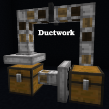

# Ductwork
Simple duct-metaphor item distribution network mod

Ductwork requires [Cooldown Coordinator](https://github.com/gniftygnome/cooldown-coordinator) and
[Cloth Config](https://github.com/shedaniel/cloth-config)!

## Features of Ductwork

This mod provides three blocks which together implement a slight superset of
the features of the Minecraft Item Hopper enabling greater flexibility and
improved game performance.  Ductwork item movement networks are often more
space and resource efficient than Hopper versions.  Another core goal of the
Ductwork mod is to deliver stable item movement similar to that of Hoppers
and suitable for use in sorting systems and other complex machines, even in
cases where Hoppers and Ductwork blocks are intermingled.

## Ductwork Blocks

### Duct

The Duct is the workhorse of a Ductwork network.  Ducts accept items from up
to five adjacent blocks, and deliver items to the block they are facing. 
Ducts cannot be locked and do not extract items from other blocks, so they
make minimal use of game resources.

### Damper

A Damper is a specialized Duct which accepts items from the block behind it
and delivers items to the block in front of it.  Unlike the basic Duct, a
Damper cannot turn corners, but it can be locked via Redstone and will
obstruct item movement while it remains locked.  Dampers can also be
temporarily locked or unlocked by the player (shift-right-click on them
with an empty hand), until the next time an adjacent block changes state.

### Collector

Collector blocks suck items from the inventory or space behind them like
a Hopper, but unlike a Hopper they can be oriented in any direction. 
Collectors deliver items from their inventory into the block in front of
them just like other Duct blocks.

## How to use Ductwork Blocks

Placement of Ductwork blocks works a lot like placement of Minecraft Item
Hoppers.  Point at the block the Ductwork block should deliver items to and
place the Ductwork block.  The Ductwork block will be "facing" the side of
the block you were pointing at.  This determines in which direction the
Ductwork block will move items (the direction it is "facing").

This can take some practice, particularly with Collector blocks!  Often,
the easiest way to place Ductwork blocks is to start at the end of the duct
(where it is delivering items) and work backward to the beginning (where it
is receiving or collecting items).

Ductwork blocks can be reoriented without breaking and re-placing them.
See the wiki for more details.

## Limited Ductworks mode

If you want Ductwork blocks to be limited to doing things you can generally
do with Item Hoppers, there is a configuration option for this.  See the
configuration file (if on a server) or the Mod Menu page (if using the
client's integrated server).  This makes Ductwork a great option for server
admins who want a pure Minecraft technical experience but also want the
performance improvements of Ductwork's Ducts.

## For more Information and Examples

See the [Ductwork wiki](https://github.com/gniftygnome/ductwork/wiki) for further documentation!
